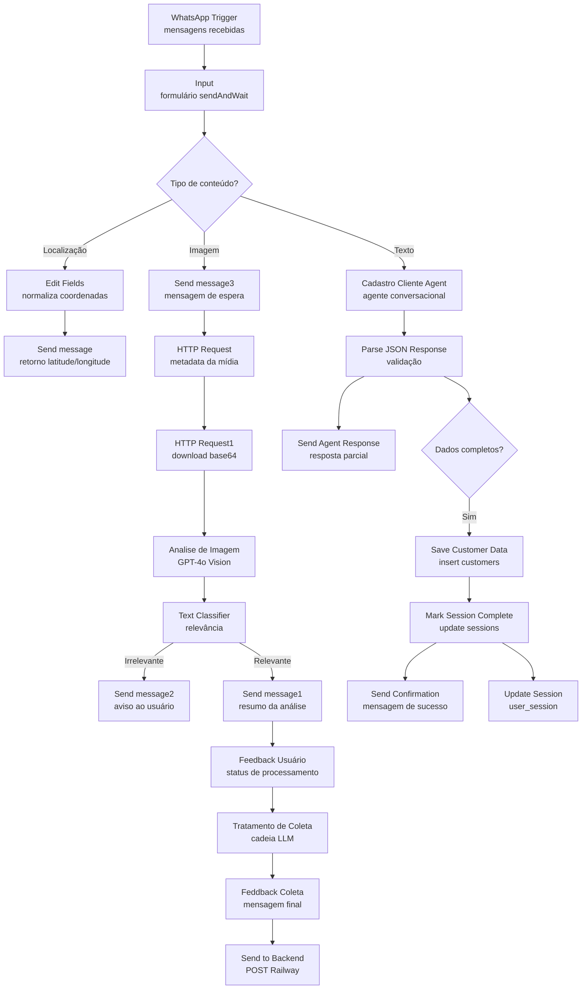
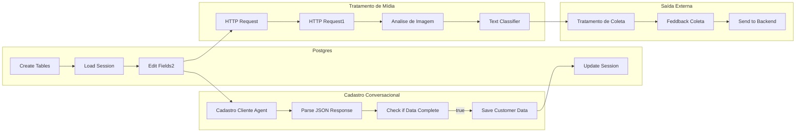

# Fluxo n8n — Mais Coleta

## Visão geral
Este workflow orquestra o atendimento “Mais Coleta” dentro do n8n para receber mensagens via WhatsApp, classificar conteúdos (texto, localização e imagem), usar modelos da OpenAI para entendimento e resposta, persistir o andamento da conversa em Postgres e acionar um backend externo para registrar solicitações de coleta.

- Entrada única pelo `WhatsApp Trigger` (Cloud API do WhatsApp Business).
- LLMs da coleção `@n8n/n8n-nodes-langchain` para visão computacional, classificação e agente conversacional.
- Persistência em tabelas Postgres e integração com um endpoint Railway para armazenamento da coleta validada.

## Pré-requisitos
- Instância n8n 1.50+ (recomendado) com acesso aos nós oficiais e ao pacote `@n8n/n8n-nodes-langchain`.
- Conta WhatsApp Business API configurada (OAuth + acesso ao Graph API) e número registrado (`phoneNumberId`).
- Chaves de API OpenAI com permissão para modelos GPT-4o / GPT-4o-mini.
- Banco Postgres acessível a partir do n8n e credencial configurada com permissão de criação de tabelas.
- Endpoint HTTP disponível para receber o payload final da coleta (`Send to Backend`).

## Mapa rápido dos nós
| Bloco                   | Nós principais                                                                                                                                                                                                         | Papel no fluxo                                                                                                          |
| ----------------------- | ---------------------------------------------------------------------------------------------------------------------------------------------------------------------------------------------------------------------- | ----------------------------------------------------------------------------------------------------------------------- |
| Disparo & contexto      | `WhatsApp Trigger`, `Input`, `Load Session`, `Edit Fields2`, `Switch`                                                                                                                                                  | Captura mensagens, envia formulário interativo e decide o tipo de conteúdo com base no payload.                         |
| Localização             | `Edit Fields`, `Send message`                                                                                                                                                                                          | Normaliza latitude/longitude recebidas e devolve confirmação ao usuário.                                                |
| Imagem                  | `Send message3`, `HTTP Request`, `HTTP Request1`, `Analise de Imagem`, `OpenAI Chat Model`, `Text Classifier`, `Edit Fields1`, `Send message1`, `Send message2`                                                        | Faz download da mídia, classifica relevância, descreve recicláveis e informa o status ao usuário.                       |
| Feedback pós-análise    | `Feedback Usuário`, `OpenAI Chat Model - Cadastro1`, `Tratamento de Coleta`, `Feddback Coleta`, `Send to Backend`                                                                                                      | Gera mensagem rica sobre coleta e registra solicitação no backend.                                                      |
| Cadastro conversacional | `Cadastro Cliente Agent`, `OpenAI Chat Model - Cadastro`, `Parse JSON Response`, `Check if Data Complete`, `Send Agent Response`, `Save Customer Data`, `Mark Session Complete`, `Send Confirmation`, `Update Session` | Guia o usuário até capturar todos os campos obrigatórios, envia respostas intermediárias e consolida dados no Postgres. |
| Infraestrutura          | `Create Tables`                                                                                                                                                                                                        | Cria tabelas de apoio (`customers`, `customer_chat_history`, `user_session`). Execute manualmente ao importar o fluxo.  |

## Fluxo detalhado
### 1. Disparo pelo WhatsApp e captura inicial
- **`WhatsApp Trigger`** recebe notificações de mensagens (texto, localização ou mídia) e injeta o item no fluxo.
- **`Input`** responde imediatamente com um formulário WhatsApp (`sendAndWait`) para acelerar a coleta de dados estruturados.
- **`Load Session` → `Edit Fields2`** consultam o Postgres (tabela `user_session`) e montam `session_data_text`, oferecendo contexto ao agente caso o usuário retorne depois.

### 2. Roteamento do conteúdo recebido (`Switch`)
- **Localização:** `Edit Fields` extrai latitude/longitude e devolve confirmação pelo nó `Send message`.
- **Imagem:** `Send message3` sinaliza que a imagem está sendo analisada, `HTTP Request` e `HTTP Request1` baixam a mídia em base64, `Analise de Imagem` (GPT-4o Vision) descreve o material, `Text Classifier` decide se é relevante ou não. Mensagens seguem por `Send message1` (relevante) ou `Send message2` (irrelevante).
- **Texto:** `Cadastro Cliente Agent` conduz diálogo natural para coletar seis atributos obrigatórios (tipo de pessoa, documento, e-mail, quantidade, foto confirmada, endereço).

### 3. Inteligência e feedback ao usuário
- **`OpenAI Chat Model`** alimenta o classificador de imagem (`Text Classifier`).
- **`OpenAI Chat Model - Cadastro`** e **`Cadastro Cliente Agent`** mantêm o diálogo contextual, retornando JSON apenas quando todas as informações foram coletadas.
- **`Parse JSON Response`** tenta transformar a saída em JSON; se falhar, continua a conversa via `Send Agent Response`.
- **`Feedback Usuário` → `Tratamento de Coleta` → `Feddback Coleta`** usam outro modelo (`OpenAI Chat Model - Cadastro1`) para transformar o laudo da visão computacional em mensagem amigável antes do envio final.

### 4. Persistência e integrações externas
- **`Check if Data Complete`** libera a rota de persistência apenas quando o JSON está completo.
- **`Save Customer Data`** insere o cadastro em `customers`. Em seguida `Mark Session Complete` sinaliza a tabela `sessions` (existente previamente) e `Send Confirmation` confirma ao usuário.
- **`Update Session`** atualiza/insere informações em `user_session`. Os valores atuais são placeholders e devem ser dinamizados conforme o JSON retornado pelo agente.
- **`Send to Backend`** publica no endpoint Railway (`/solicitacoes/`) um corpo JSON que combina dados do usuário com a análise de imagem.

## Diagramas
### Visão geral do fluxo

### Contexto e persistência

## Parâmetros e pontos de atenção
- **IDs do WhatsApp (`phoneNumberId`, `recipientPhoneNumber`)**: estão preenchidos com valores do ambiente de origem. Substitua pelos IDs do seu número oficial.
- **`Send to Backend`** utiliza uma URL Railway de exemplo. Ajuste a rota, o corpo e, se necessário, autenticação.
- **`Update Session`** contém valores estáticos (nome, endereço, etc.). Use expressões dinâmicas para persistir dados reais ou limpe os campos não utilizados.
- **`Mark Session Complete`** depende de uma tabela `sessions` existente; inclua-a no script de criação ou ajuste a query.
- **`Load Session` / `Edit Fields2`** assumem um campo `session_data_text` em `user_session`. Acrescente essa coluna ou adapte o mapeamento para o formato desejado.
- **Uso de LLMs**: revise limites de tokens e custos. Os modelos configurados (GPT-4o/GPT-4o-mini) podem ser trocados no editor caso necessário.

## Como validar rapidamente
- Importe `JSON_N8N.json` no n8n, configure credenciais (WhatsApp, OpenAI, Postgres e HTTP Bearer) e execute `Create Tables` uma vez.
- Utilize o modo **Test** do `WhatsApp Trigger` enviando mensagens com localização, imagem e texto para verificar cada rota.
- Monitore a aba **Executions**: valide payloads intermediários dos nós `Analise de Imagem`, `Parse JSON Response` e `Send to Backend`.
- Confira os registros inseridos em `customers` e `user_session` para garantir que os dados estejam consistentes.

## Próximos passos sugeridos
1. Introduzir variáveis ambientais (`{{$env}}`) para URLs, tokens e IDs, facilitando a promoção entre ambientes.
2. Registrar histórico de conversa em `customer_chat_history` (já criado pelo script) alimentando o agente com o contéudo real.
3. Implementar retries e tratamento de erros explícitos nos nós de HTTP e Postgres para maior resiliência em produção.

## 👩‍💻 Equipe

| Nome             | Função             | Email                      |
| ---------------- | ------------------ | -------------------------- |
| Lucas Messias    | Frontend Developer | lucasmessias98@hotmail.com |
| Vinicius Brunoni | Backend Developer  | viniciusbrunoni@me.com     |
| Paulo Jalowyj    | UX/UI Designer     | pgm.jalowyj@gmail.com      |